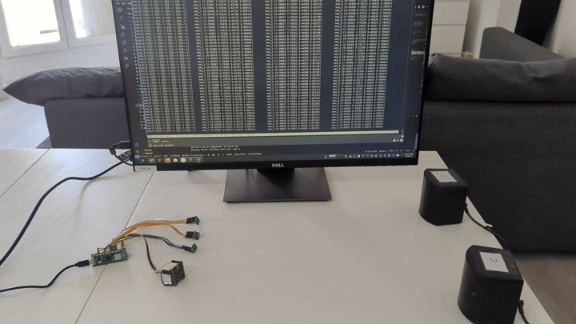
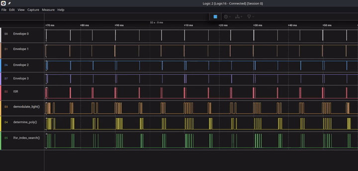
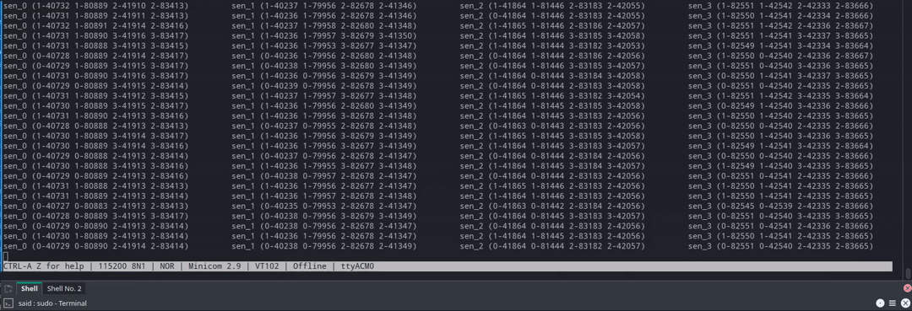
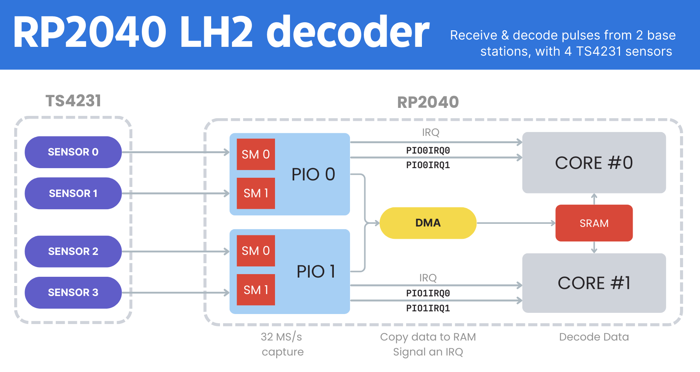
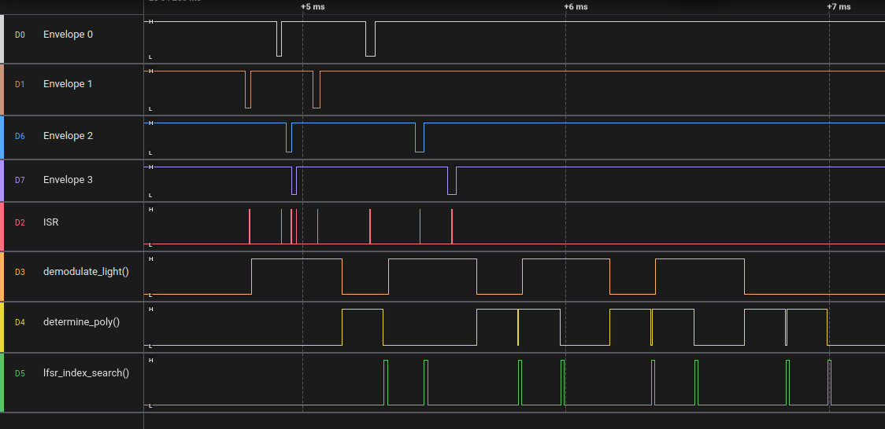
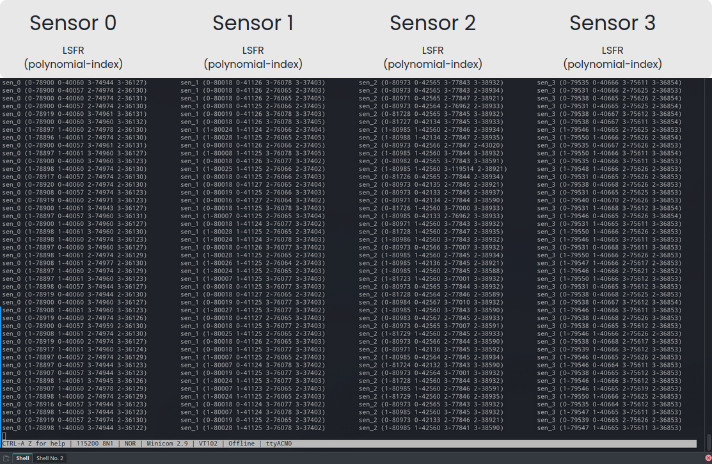
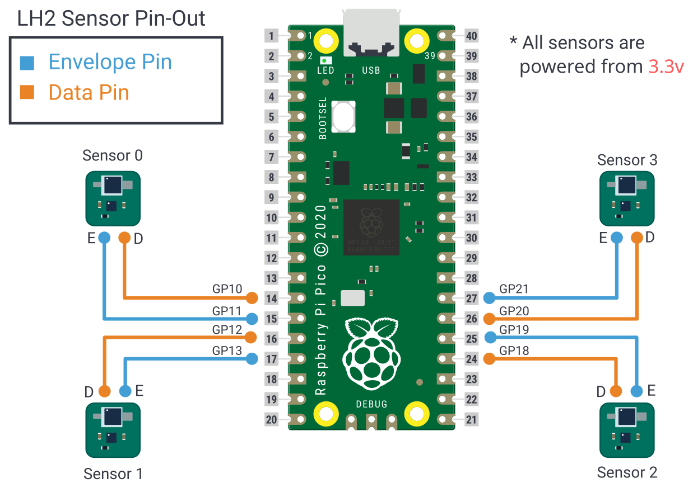

# LH2 Decoder on RP2040/RP2350
Valve's Lighthouse v2 positioning system decoder implemented for the RP2040/RP2350.
100% CPU implementation.

4 `TS4231` are connected to a `RP2040`. The MCU receives and decodes data from two LH2 basestations.

<p align="center">
  
</p>

A logic analyser is connected to the system. It shows the arriving data, and how much time it takes the CPU to decode the data.
<p align="center">
  
</p>

The decoded data is printed to a serial port trough the USB. 
<p align="center">
  
</p>


## How does it work

The code uses the `PIO` system to sample the data from the `TS4231`. Four PIO state machines samples each `TS4231` data line for 16us at a constant rate of `32 MS/s`.
The capture data is automatically moved to a buffer in RAM using the DMA system. After each successful capture, the PIO state machine triggers an interrupt. 
This signals the CPU to retrieve the data from the buffers and decode it. Each core of the `RP2040` monitors and processes two `TS4231` sensors

<p align="center">
  
</p>

### Results and Benchmark

Below is a capture from two sweeps of a basestation.
- Top 4 lines:  Envelope pin of the `TS4231`. It signals the presence of data
- Bottom 4 lines: Benchmark of each function in the decoding function
All 8 pulses from a full sweep of the basestation, can be decoded in less than `3ms`.
Full bench mark available [here](https://github.com/DotBots/lh2_on_rp2040/issues/2).
<p align="center">
  
</p>

All the decoded information gets printed to the serial console in the following format.
<p align="center">
  
</p>

## Getting Started

### Circuit Schematic
Required Hardware:
- 1x Raspberry Pi Pico version 1 or 2. [[Link]](https://www.raspberrypi.com/documentation/microcontrollers/pico-series.html)
- 4x TS4231 Lighthouse v2 sensors.
  - Recommended hardware: [TS4231 Breakout Board](https://github.com/DotBots/TS4231-breakout-board)

Connect the LH2 sensors to the Raspberry Pi Pico as shown in the diagram below.

<p align="center">
  
</p>


### Build & Flash the code
1. Clone the repository and initialize the SDK submodule
```bash
git clone https://github.com/DotBots/lh2_on_rp2040.git
cd lh2_on_rp2040
git submodule update --init
cd pico-sdk
git submodule update --init
cd ..
```

2. Set the enviroment variable
To let the system know where is the SDK
```bash
export PICO_SDK_PATH=$PWD/pico-sdk
```

3. Create a build directory and run CMAKE
```bash
mkdir build && cd build

# For the Pico 2 board
cmake .. -D"PICO_BOARD=pico2"
# For the Pico 2W board
cmake .. -D"PICO_BOARD=pico2_w"
# For the Pico 1 board
cmake .. -D"PICO_BOARD=pico"
# For the Pico 1W board
cmake .. -D"PICO_BOARD=pico_w"
```

4. Build project
```bash
make
```

5. Flash the `lh2_receiver.uf2` file to the microcontroller/


## References

- How to change the CPU system clock, with `set_sys_clock_khz(128000, true)` [Link](https://forums.raspberrypi.com/viewtopic.php?t=301902)
  - this function is available from stdlib.h
  - The script `pico-sdk/src/rp2_common/hardware_clocks/scripts/vcocalc.py` confirms that 128MHz is an achievable frequency.
